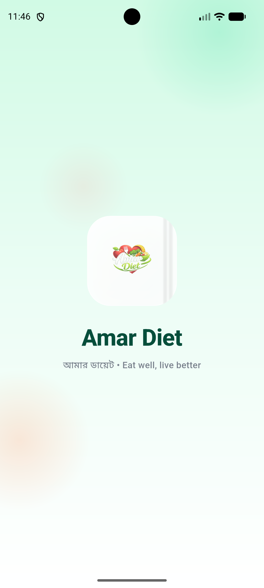
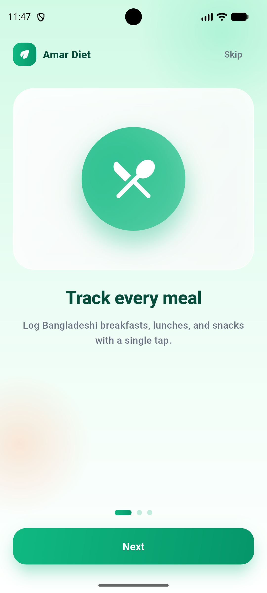
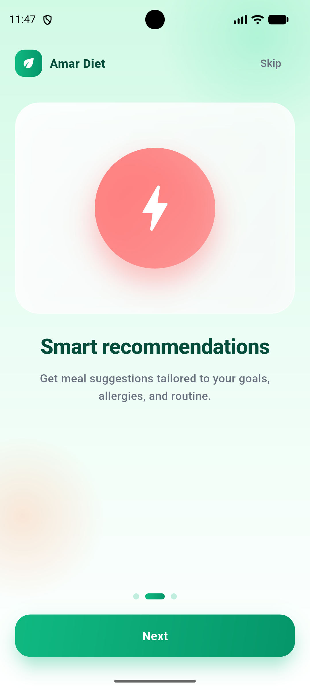
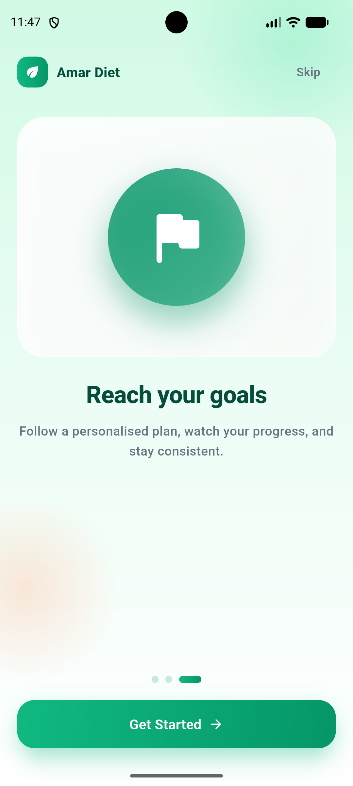
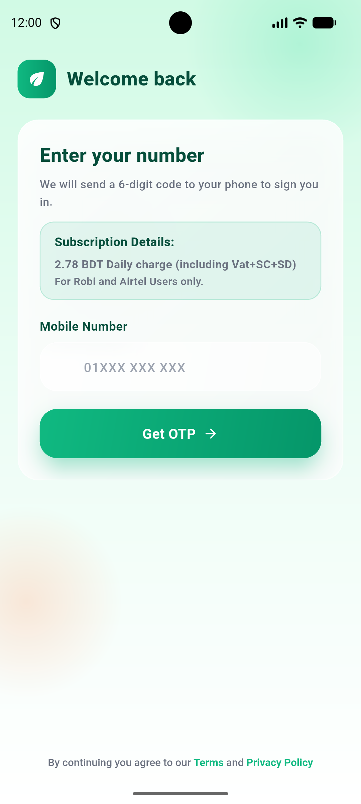
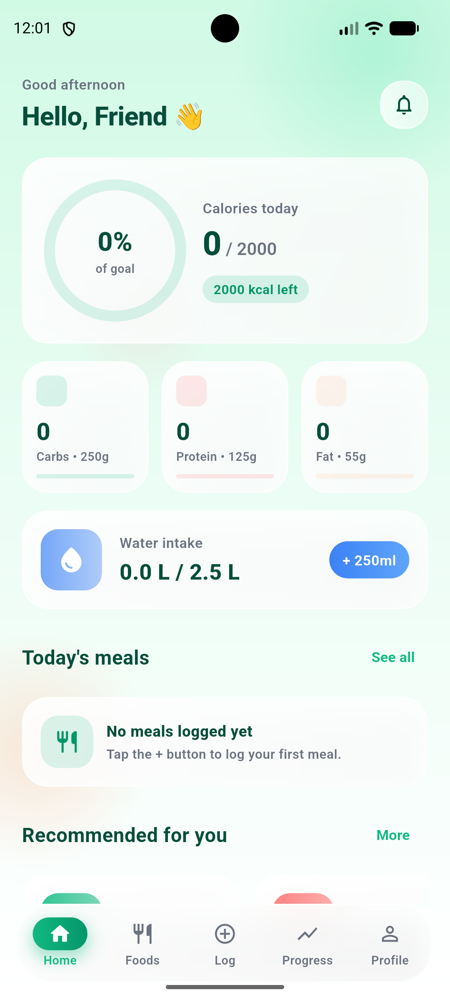
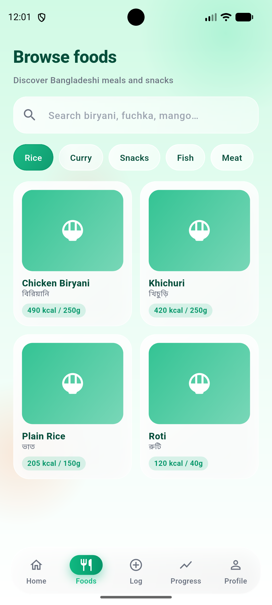
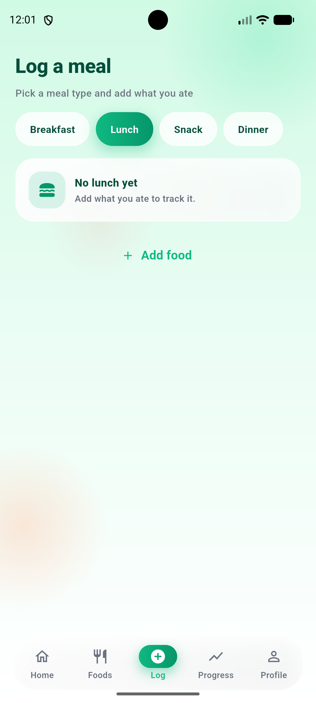
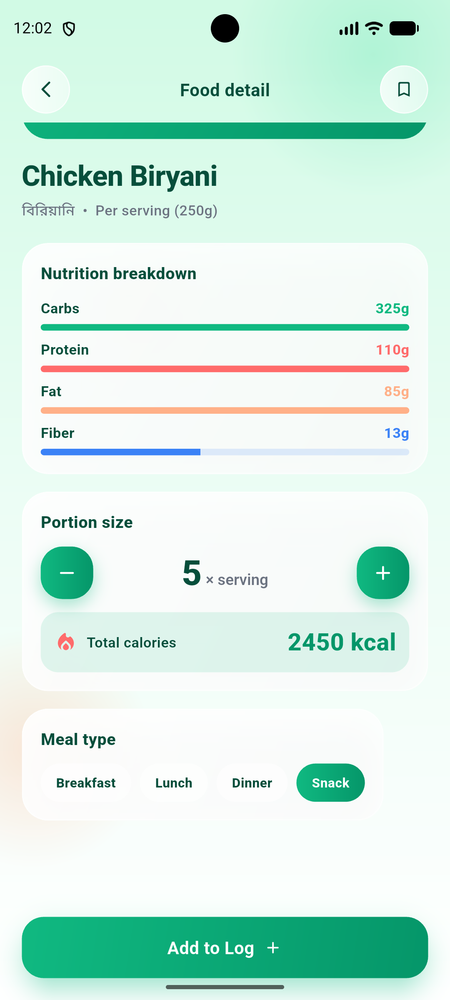

# Amar Diet — আপনার ডায়েট কোচ 🥗

**Amar Diet** is a personalized nutrition and diet-tracking app built specifically for Bangladeshi users. Track calories, monitor water intake, and reach your fitness goals with a food library designed around the meals you actually eat.

🔗 **Official Website:** [https://amardiet.byabir.com/](https://amardiet.byabir.com/)

---

## 📸 App Preview

  
  
  
  

---

## ✨ Key Features

- **🇧🇩 Bangladeshi Food Library:** Log meals like plain rice, hilsa curry, biryani, and khichuri with accurate local nutrition data.
- **🔥 Calorie Tracking:** Set your goal (Lose, Maintain, or Gain weight) and let the app calculate your BMR and TDEE.
- **💧 Water Tracker:** Log your daily water intake with a clean, visual interface.
- **📈 Progress Analytics:** View weekly trends, macro-nutrient splits, and weight history in one dashboard.
- **🧠 Smart Recommendations:** Get meal suggestions tailored to your health goals and preferences.
- **📊 Weekly Planning:** Set targets for the week and keep your streak alive.

---

## 🛠️ How It Works

1. **Subscribe:** Active Robi or Cirkle users can subscribe via Web, SMS, or USSD.
2. **Install:** Download the official APK from our portal.
3. **Log In:** Use your verified mobile number and a secure BDApps OTP code.
4. **Track:** Start logging your meals and watch your progress!

---

## 💳 Subscription & Pricing

Amar Diet is a premium service powered by **BDApps**.

- **Daily Charge:** ৳2.78 / day (incl. Vat+SC+SD)
- **Bundled Equivalent:** ৳5.56 / 5 days
- **Operator:** Robi and Cirkle users only.

---

## 📱 More Screens

  
  
  
  
  

---

## 🌐 Get Started
Visit our landing page to subscribe or download the latest APK:
👉 [**Amar Diet Portal**](https://amardiet.byabir.com/)

© 2024 Amar Diet. All rights reserved.
